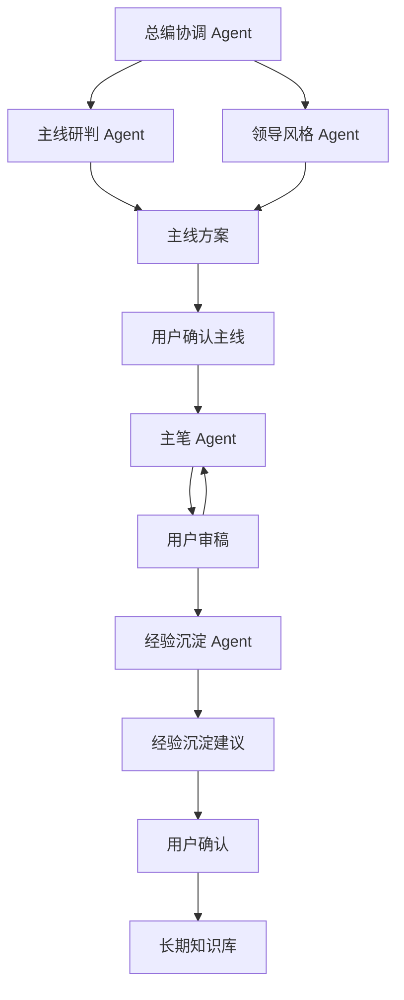
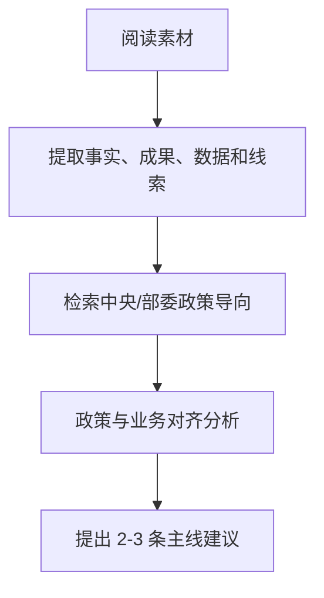

# 多 Agent 协同写作工具产品方案 v0.1

> ⚠️ **已废弃**:第一阶段已简化执行,本文仅保留长期产品架构思路,不要按本文搭建第一阶段。

> 执行口径更新：第一阶段实际落地采用简化结构 `docs/`、`app/`、`data/`。本文保留长期产品架构思路，但第一阶段不要按完整 `agents/templates/knowledge/runs/services` 框架搭建。执行时以 `docs/wecom-learning-gateway-development-plan-v0.1.md` 和 `docs/phase-1-prototype-structure.md` 为准。

## 一、背景与目标

用户经常需要撰写面向政府部门的正式工作文稿，尤其是面向中央部委、国家层面的成果展示类报告。此类报告既要体现政策高度，也要体现公司业务特色，还要符合不同领导的表达风格。

本工具第一阶段不急于做完整软件，而是先验证一套多 Agent 协同写作方法是否能明显提升报告质量，重点解决以下问题：

1. 主线判断不准，容易变成材料堆砌。
2. 政策站位不足，缺少中央和部委层面的政策高度。
3. 业务价值表达泛泛，不能把公司业务转化成政府部门关心的公共价值。
4. 领导风格适配不够，不同领导对成绩表达、政策建议和文章气质的偏好不同。

第一版的目标不是“全自动写完一篇稿子”，而是先把“素材理解、政策研判、主线建议、领导风格适配、初稿生成”这条链路跑通。同时，工具后续应具备经验沉淀能力：每完成一篇稿子，都能从项目实践中提炼可复用经验，在用户确认后进入长期知识库，方便下一次任务调用。

## 二、需求讨论过程与关键判断

最初设想是做一个多 Agent 协同写作工具，让多个 Agent 分别承担素材理解、政策研究、业务价值转译、领导风格、主笔、审稿等工作。讨论过程中逐步明确：Agent 不是越多越好，关键是每个 Agent 是否有独立判断标准，是否能带来不同视角。

### 1. 关于文稿场景

第一版聚焦“面向政府部门的正式报告”，尤其是面向中央部委、国家层面的成果展示类报告。报告主线通常是展示公司某一方向的工作成果，政策建议可以出现，但不是主线。

具体到公司场景，第一版以微众银行相关报告为样板，常见主题包括服务小微企业、普惠金融、服务实体经济、科技创新、金融科技等。每篇报告原则上只围绕一个核心方向展开，避免面面俱到。

### 2. 关于素材形态

用户通常提供的是零散要点和部分基础素材，而不是完整材料。因此工具不能假设素材天然完整，需要先阅读材料、理解事实、识别亮点和缺口，再进入政策研究和写作。

### 3. 关于政策研究

政策研究不能只是在文章里加几句政策口号。理想流程是：先根据用户提供的素材和方向线索，检索中央、部委层面的公开政策、会议精神和监管导向，再把政策导向与公司业务成果融合起来，形成报告主线。

政策依据必须可核查，不能凭印象编造。

### 4. 关于 Agent 拆分

最初讨论过将“素材理解 Agent”“政策研究 Agent”“业务价值转译 Agent”拆开。但进一步分析后认为，这三件事在实际写作中高度串行：

1. 先阅读素材，理解事实、成果、数据和业务线索。
2. 再根据素材线索检索政策导向。
3. 最后把业务成果转译成政策语境下的价值表达。

如果硬拆成三个 Agent，容易出现割裂：政策研究 Agent 不理解素材，价值转译 Agent 不掌握政策依据，最后只能由协调 Agent 拼接，反而降低质量。

因此，第一版将这三项能力合并为一个“主线研判 Agent”的内部工作流程。

### 5. 关于业务价值和领导风格

业务价值和领导风格需要拆开。

业务价值解决的是“讲什么价值”，例如服务小微、服务实体经济、金融科技赋能、风险可控、可复制推广等。

领导风格解决的是“怎么讲、讲到什么分寸”，例如低调务实、突出成绩、稳健专业、偏政策建议等。

领导风格不应只在最后润色阶段介入，而应在前期影响主线选择，在后期提出风格审阅意见。但第一版中，领导风格 Agent 只提意见，不直接改稿，避免破坏文章结构和事实表达。

### 6. 关于审稿

第一版暂不设置独立审稿 Agent。现阶段由用户本人担任审稿人，因为用户最清楚真实口径、领导偏好和材料边界。后续如果流程验证有效，再考虑增加政策审稿、事实审稿、文风审稿等角色。

### 7. 关于经验沉淀和自我迭代

后续讨论中进一步明确：这个工具不应只停留在“每次从零开始写一篇稿子”。理想状态是，随着项目实践推进，工具能逐步积累素材、政策依据、领导风格、用户修改意见和最终稿经验，并在后续任务中自动参考这些经过确认的经验。

这种方向与 Hermes Agent 一类工具强调的“长期记忆、技能沉淀、跨会话改进”有相似之处。但本项目不应一开始追求完全自主学习或自动修改自身规则。更适合的方向是“受控自我迭代”：系统可以提出本次任务中值得沉淀的经验，但必须经过用户确认后，才能写入长期知识库。

因此，本工具未来应增加一个后置的“经验沉淀机制”。它不参与第一次写稿的核心判断，而是在每篇报告完成后，对任务过程和最终结果进行复盘，提炼可复用的公司知识、政策知识、领导风格知识、写作经验和流程规则。

## 三、第一版适用场景

第一版适用于以下场景：

1. 用户需要撰写一篇面向中央部委或国家层面的正式报告。
2. 报告以成果展示为主，政策建议为辅。
3. 用户提供零散要点、部分基础素材、报告对象、主题方向和领导风格说明。
4. 工具先帮助判断文章主线，再进入初稿写作。
5. 用户本人负责确认主线和审稿。

典型样板主题：微众银行服务小微企业成果报告。

## 四、第一版 Agent 架构

第一版采用“四类写作 Agent + 一个经验沉淀 Agent + 用户审稿”的结构。



### 1. 总编协调 Agent

总编协调 Agent 是唯一直接面向用户的流程控制者，类似“项目经理 + 总编辑”。

主要职责：

1. 接收用户任务、素材、报告对象和方向要求。
2. 判断信息是否足够，不足时先向用户追问。
3. 调度主线研判 Agent 和领导风格 Agent。
4. 把多个 Agent 的意见整理成用户能判断的选项。
5. 在关键节点暂停，请用户确认主线、口径和修改方向。
6. 将用户确认后的意见交给主笔 Agent。
7. 保留每轮版本变化和用户修改要求。

总编协调 Agent 不应自己长篇写稿，除非进入主笔阶段。它的核心价值是让整个过程可控。

### 2. 主线研判 Agent

主线研判 Agent 是第一版最核心的 Agent。它不直接写全文，而是先判断这篇报告应当如何立意。

内部流程：



主要职责：

1. 阅读用户提供的基础素材。
2. 提取可用事实、数据、案例、成果和信息缺口。
3. 根据素材线索检索中央、部委层面的公开政策依据。
4. 分析公司成果与政策导向之间的对应关系。
5. 将业务成果转译成政府部门能理解的公共价值。
6. 提出 2-3 条可选报告主线，并说明推荐理由和风险。

### 3. 领导风格 Agent

领导风格 Agent 分两个阶段介入。

前期介入主线策划：

1. 判断哪条候选主线更符合领导风格。
2. 判断哪些成果适合重点强调。
3. 判断政策建议应该写到什么分寸。
4. 判断文章气质应偏低调务实、稳健专业、成果展示，还是政策建议型。

后期介入风格审阅：

1. 指出哪些地方不像该领导口气。
2. 指出哪些成绩表述过强或过弱。
3. 指出哪些政策表述需要更稳妥。
4. 判断全文是否符合政府部门报告的正式口径。

第一版中，领导风格 Agent 只提出意见，不直接改全文。

### 4. 主笔 Agent

主笔 Agent 在用户确认主线后开始工作。

主要职责：

1. 根据主线研判表、领导风格意见和用户素材生成初稿。
2. 按照政府部门报告的正式文风组织结构。
3. 将政策依据、公司成果和业务价值融入正文，而不是简单堆在开头或结尾。
4. 根据用户审稿意见进行修改。

### 5. 经验沉淀 Agent

经验沉淀 Agent 不参与主线研判和初稿写作，主要负责从日常材料和正式写稿任务中提炼可复用经验。

它有两个触发场景：

1. 正式任务完成后，从 `runs` 中读取任务说明、素材、主线研判表、领导风格意见、初稿、修改意见和最终稿，生成经验沉淀建议。
2. 日常讨论材料进入 `inbox` 后，从会议纪要、聊天记录、修改意见、定稿对比等材料中提炼领导风格、写作规则、表达偏好和慎用表达。

主要职责：

1. 提炼领导风格观察，例如表达偏好、成绩表述分寸、政策建议分寸、常用表达和慎用表达。
2. 提炼写作规则，例如某类素材适合形成什么主线，哪些结构和表达更容易被用户接受。
3. 提炼公司知识和政策知识的候选内容，但必须标明来源和适用场景。
4. 判断哪些内容只适用于本次任务，不建议沉淀为长期知识。
5. 生成“经验沉淀建议”，提交给用户确认。

经验沉淀 Agent 不能直接修改长期知识库。只有用户确认后，相关内容才能写入 `knowledge`。

### 6. 用户本人

用户本人是最终审稿人和判断者。

主要职责：

1. 提供素材、方向、报告对象和领导风格说明。
2. 确认工具提出的主线方案。
3. 判断文章口径是否符合真实工作要求。
4. 对初稿提出修改意见。
5. 确认最终稿。
6. 确认哪些经验可以写入长期知识库。

## 五、核心流程

第一版流程如下：

1. 用户输入任务、报告对象、基础素材、方向线索和领导风格说明。
2. 总编协调 Agent 判断信息是否足够，不足则先追问。
3. 主线研判 Agent 阅读素材，并检索公开、可核查的中央/部委政策依据。
4. 主线研判 Agent 输出“主线研判表”。
5. 领导风格 Agent 对候选主线提出适配意见。
6. 总编协调 Agent 汇总为 2-3 条主线方案，请用户确认。
7. 用户确认主线。
8. 主笔 Agent 生成初稿。
9. 用户审稿并提出修改意见。
10. 主笔 Agent 根据意见修改。
11. 如有必要，领导风格 Agent 补充风格审阅意见，但只提意见，不直接改稿。
12. 稿件完成后，经验沉淀 Agent 进入复盘环节，提炼本次任务中可复用的经验。
13. 用户确认哪些经验可以沉淀，确认后写入长期知识库。

## 六、主线研判表 v0.1

主线研判 Agent 每次输出一张“主线研判表”，包括以下栏目：

1. 素材摘要：这批材料主要讲了什么。
2. 可用事实：哪些数据、案例、成果可以写进报告。
3. 政策线索：素材对应哪些中央/部委政策方向。
4. 政策依据：检索到哪些可引用的正式政策来源。
5. 价值转译：这些成果对政府部门意味着什么。
6. 可选主线：提出 2-3 条报告主线。
7. 推荐主线：说明最推荐哪条，以及原因。
8. 风险提醒：哪些表述容易过满、依据不足或需要补材料。
9. 补充问题：为了写好初稿，还需要用户补充什么。

这张表是第一版工具的核心产物之一。它的作用是先帮助用户判断“这篇报告应该怎么立意”，而不是直接进入写稿。

## 七、领导风格适配意见 v0.1

领导风格 Agent 前期输出“领导风格适配意见”，包括：

1. 该领导适合突出哪类价值。
2. 哪条候选主线最符合领导风格。
3. 哪些成果可以适当强调。
4. 哪些表述需要克制。
5. 政策建议应该写到什么分寸。
6. 建议采用的语气类型，例如低调务实、稳健专业、成果展示、政策建议型。

初稿完成后，领导风格 Agent 输出“风格审阅意见”，包括：

1. 哪些地方不像该领导口气。
2. 哪些成绩表述过强或过弱。
3. 哪些政策表述需要更稳。
4. 哪些表达不符合政府部门报告口径。
5. 是否建议由主笔 Agent 进行局部调整。

第一版中，领导风格 Agent 只提意见，不直接改写全文。

## 八、经验沉淀与受控自我迭代机制 v0.1

经验沉淀机制用于解决一个长期问题：工具不能每次都从零开始，而应随着真实写作任务逐步变得更懂公司、更懂政策、更懂领导风格、更懂用户判断标准。

但这种“自我迭代”必须是受控的。系统不能自动把所有内容都写入长期知识库，也不能未经确认就改变自己的写作规则。每次沉淀前，都应由用户确认。

### 1. 每篇任务需要保留的项目记录

每完成一篇报告后，系统应保存一份任务记录，包括：

1. 原始任务说明。
2. 用户提供的素材。
3. 主线研判表。
4. 领导风格适配意见。
5. 用户最终选择的主线。
6. 初稿。
7. 用户修改意见。
8. 最终稿。
9. 本次任务的关键取舍说明。

这些记录属于项目实践资料，不一定全部进入长期知识库，但可以作为后续复盘依据。

### 2. 可沉淀的长期经验类型

系统应从任务记录中提炼以下几类长期经验：

1. 公司知识：公司业务、成果、常用数据、公开可用表述、业务边界。
2. 政策知识：某类主题常用的中央/部委政策依据、关键词、政策表述方式。
3. 领导风格知识：某位领导偏好的表达气质、成绩呈现方式、政策建议分寸、禁用或慎用表达。
4. 写作经验：某类素材适合形成什么主线，哪些主线曾被用户认可或否定。
5. 流程经验：某类报告在主线研判、政策检索、初稿结构上的常见处理方式。
6. 优秀表达：最终稿中被保留或用户认可的典型句式、段落结构和表达方式。
7. 风险提示：曾经被用户指出不准确、过满、过虚、过宣传化或依据不足的表达。

### 3. 用户确认机制

每次任务结束后，系统可以生成一份“经验沉淀建议”，但必须提交给用户确认。

建议格式如下：

1. 建议沉淀的公司知识。
2. 建议沉淀的政策依据。
3. 建议沉淀的领导风格规则。
4. 建议沉淀的写作规则。
5. 建议加入禁用或慎用清单的表达。
6. 不建议沉淀的内容及原因。

用户可以选择：确认写入、修改后写入、暂不写入、删除某条经验。

### 4. 日常 inbox 机制

经验沉淀不必只发生在一篇正式稿件完成后。日常讨论、修改意见、会议纪要、聊天记录和定稿对比也可以作为风格学习材料。

建议为领导风格和通用经验积累设置 `inbox` 和 `extracted` 两层：

```text
knowledge/
  leader-style/
    某领导/
      inbox/
      extracted/
      style-card.md
      accepted-expressions.md
      avoid-list.md
      update-log.md
```

其中：

1. `inbox` 保存用户随手放入的原始材料，例如会议纪要、修改意见、聊天记录、定稿前后对比。
2. `extracted` 保存经验沉淀 Agent 从原始材料中提炼出的风格观察和更新建议。
3. `style-card.md`、`accepted-expressions.md`、`avoid-list.md` 等文件只保存用户确认后的长期经验。

日常使用时，用户只需要把材料放入 `inbox`，然后让经验沉淀 Agent 生成提炼建议。经验沉淀 Agent 不能直接修改风格卡或表达库，必须先输出建议，等待用户确认。

### 5. 下次任务的调用方式

下一次处理相似任务时，总编协调 Agent 应先检索长期知识库，并明确告诉用户本次参考了哪些历史经验。例如：

1. 参考了哪位领导的风格档案。
2. 参考了哪类主题的历史主线判断。
3. 参考了哪些政策资料。
4. 参考了哪些过往稿件表达。
5. 哪些历史经验可能已经过期，需要重新确认。

这样既能提高连续性，也能让用户知道系统为什么这么判断。

### 6. 与 Hermes 类能力的关系

本项目可以借鉴 Hermes Agent 一类工具的长期记忆和技能沉淀思想，但不建议第一版直接追求完全自主进化。

更适合本项目的表达是：受控经验沉淀，而不是自动自我进化。

也就是说，工具可以越来越懂用户和写作场景，但每一次重要规则沉淀都应可追溯、可修改、可删除，并由用户确认。

## 九、关键原则

1. 政策依据必须可核查，不能凭空编造。
2. 素材事实优先，不能为了拔高而扭曲业务。
3. 每篇报告只围绕一个主方向，避免面面俱到。
4. 多 Agent 的价值在于形成不同判断视角，不是让 Agent 自由聊天。
5. 关键判断必须由用户确认，不能自动一路写到底。
6. 领导风格应影响主线和表达分寸，而不是只做最后润色。
7. 经验沉淀必须经过用户确认，不能自动无差别写入长期知识库。
8. 长期知识应可追溯、可修改、可删除，避免错误经验不断累积。
9. 第一版重点验证写作流程质量，不急于做复杂产品界面。

## 十、后续演进方向

如果第一版流程验证有效，后续可以逐步扩展：

1. 建立公司基础档案库。
2. 建立领导风格档案库。
3. 增加历史稿件学习能力。
4. 增加政策资料库和引用管理。
5. 增加版本对比、修改记录和定稿检查。
6. 增加独立审稿 Agent，例如政策审稿、事实审稿、文风结构审稿。
7. 增加经验沉淀建议和用户确认机制。
8. 增加长期知识库的检索、引用、更新和删除能力。
9. 最终再考虑做成本地网页工具或文档工作台。

## 十一、当前推荐落地方式

当前不建议立刻开发完整软件。第一阶段明确采用 Claude、Codex 等 AI 开发/写作工具来运行流程，不做网页入口，不做复杂后台，也不直接引入重型多 Agent 框架。

第一阶段的项目形态不是一个完整软件，而是一个“AI 可执行的写作工作区”：通过项目文件夹中的 Agent 定义、模板、长期知识库和任务记录，让 Claude/Codex 按固定流程完成主线研判、领导风格适配、初稿生成、修改和经验沉淀。

这样做的原因是，当前最重要的问题不是界面和后台，而是验证写作流程质量。只有先用真实材料跑 1-2 篇样稿，确认主线研判、政策融合和领导风格适配确实优于直接让 AI 写稿，再进入产品化和界面设计阶段。

进一步讨论后，第一阶段的第一个落地点调整为“企业微信经验沉淀入口”，先从经验沉淀 Agent 做起，而不是直接做完整写作流程。

用户希望日常只需要把文档、讨论记录、修改意见等材料发给企业微信智能机器人，后台自动完成材料接收、文件解析、经验提炼、沉淀建议生成，并通过企业微信返回给用户确认。用户确认后，再写入长期知识库。

技术路线采用“成熟企业微信长连接 SDK + 自建经验沉淀业务逻辑”。不建议第一版直接将 OpenClaw、Hermes、LangBot 等大框架作为主系统，也不建议从 WebSocket 协议层完全自建。企业微信接入层复用成熟 SDK，经验沉淀、用户确认、知识库写入等核心逻辑由本项目自建。

第一阶段交付物建议包括：

1. Agent 角色定义。
2. 每个 Agent 的输入输出模板。
3. 主线研判表模板。
4. 领导风格适配意见模板。
5. 总编协调流程提示词。
6. 一篇真实样稿的流程测试记录。
7. 经验沉淀建议模板。
8. 长期知识库的初始目录结构。
9. 第一阶段原型结构说明。
10. 企业微信经验沉淀入口设计说明。
11. 企业微信长连接接入与文件处理最小闭环。

只有在流程验证有效后，再进入产品化和界面设计阶段。
