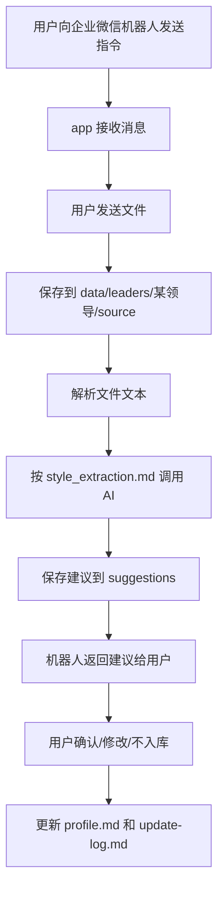

# 第一阶段原型结构说明

## 一、阶段定位

第一阶段的第一个落地点是“企业微信经验沉淀入口”。

第一阶段不做完整写稿工具，不做网页后台，不做数据库，也不搭一套复杂 Agent 框架。目标是先让用户能用企业微信机器人低成本提交日常材料，系统自动提炼领导风格建议，并返回给用户确认。

当前优先验证：

1. 企业微信入口是否能降低日常材料沉淀成本。
2. AI 是否能从日常材料中提炼出有用的领导风格观察。
3. 用户是否能方便地确认、修改或拒绝沉淀建议。
4. 项目结构是否足够简单，便于后续维护和迭代。

## 二、第一阶段实际目录结构

第一阶段实际落地采用简化结构：

```text
M-Agent/
  README.md
  AGENTS.md
  CLAUDE.md
  .gitignore

  docs/

  app/
    README.md
    config.example.env
    main.py
    prompts/
      style_extraction.md

  data/
    leaders/
      example-leader/
        source/
        suggestions/
        profile.md
        update-log.md
```

通俗理解：

1. `docs`：保存方案、设计和开发计划。
2. `app`：保存实际能运行的小程序。
3. `app/prompts`：保存 AI 分析用的提示词。
4. `data`：保存日常材料、AI 提炼建议和用户确认后的领导风格档案。

第一阶段不要真实创建以下复杂目录：

```text
agents/
templates/
knowledge/
runs/
services/
```

这些是未来演进概念，不是第一阶段必须落地的工程结构。

## 三、简化结构与长期概念的对应关系

我们之前讨论过 `agents`、`templates`、`knowledge`、`runs` 四类内容。它们作为长期架构概念仍然成立，但第一阶段用更简单的方式承载：

| 长期概念 | 第一阶段实际承载方式 |
|---|---|
| Agent 定义 | 写入 `app/prompts/style_extraction.md` |
| 输出模板 | 写入 `app/prompts/style_extraction.md` |
| 长期知识库 | 写入 `data/leaders/某领导/profile.md` |
| 原始材料 | 写入 `data/leaders/某领导/source/` |
| 提炼建议 | 写入 `data/leaders/某领导/suggestions/` |
| 运行记录 | 暂时写入 `data/leaders/某领导/update-log.md` |

这样做的原因是：第一阶段只有一个核心动作，即“领导风格提炼”。没有必要一开始就拆出多个目录和多套模板。

## 四、数据目录说明

每位领导对应一个目录：

```text
data/
  leaders/
    张总/
      source/
      suggestions/
      profile.md
      update-log.md
```

### 1. source

保存用户通过企业微信发来的材料，以及系统解析后的文本。

示例：

```text
2026-05-18-235901-原始文件.docx
2026-05-18-235901-解析文本.md
2026-05-18-235901-meta.md
```

### 2. suggestions

保存 AI 生成的领导风格提炼建议。

示例：

```text
2026-05-18-235901-style-suggestion.md
```

### 3. profile.md

保存用户确认后的领导风格档案。

第一阶段可以合并保存以下内容：

1. 总体风格。
2. 成绩表达偏好。
3. 政策建议分寸。
4. 常用表达。
5. 慎用表达。
6. 适用场景。

### 4. update-log.md

记录每次更新来源和确认方式。

示例：

```text
## 2026-05-18 23:59

来源材料：
确认人：
确认方式：
更新内容：
```

## 五、第一阶段运行流程



第一阶段只需要跑通这个闭环。

## 六、为什么先不拆复杂目录

不拆复杂目录的原因：

1. 用户更容易理解项目结构。
2. 后续维护者更容易接手。
3. 当前功能单一，没有必要先搭完整框架。
4. 目录少，执行 AI 更不容易跑偏。
5. 等功能稳定后，再按真实需要拆分。

未来如果出现以下情况，再考虑拆出 `agents/templates/knowledge/runs`：

1. 不止一个稳定 Agent。
2. 不止一个稳定模板。
3. 领导风格、公司知识、政策知识都开始独立积累。
4. 正式写稿流程开始跑通。
5. `data` 目录已经难以维护。

## 七、第一阶段成功标准

第一阶段成功标准：

1. 用户能通过企业微信机器人发送材料。
2. 程序能保存并解析材料。
3. AI 能生成结构化领导风格提炼建议。
4. 机器人能把建议返回给用户确认。
5. 用户确认后，程序能更新 `profile.md` 和 `update-log.md`。
6. 项目结构保持简单，用户能理解每个目录的作用。

只有这些成立后，再考虑扩展到完整知识库和写稿流程。
