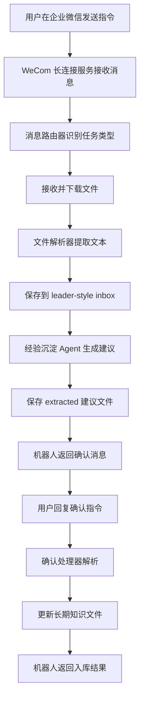
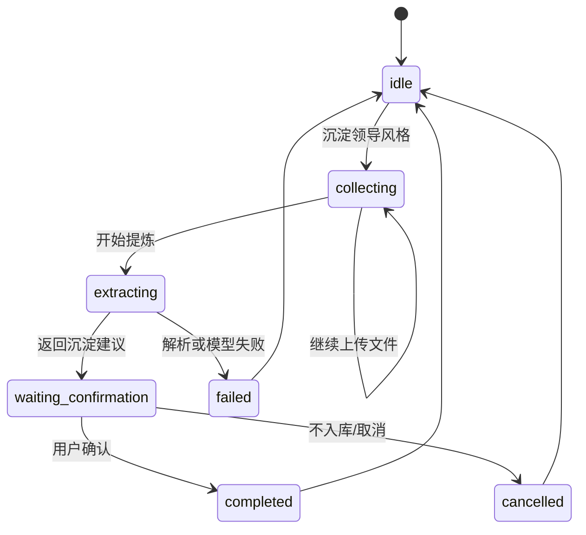

# 企业微信经验沉淀入口实施设计 v0.1

> 执行口径更新：第一阶段实际落地采用简化结构 `docs/`、`app/`、`data/`。本文中较早出现的 `knowledge/leader-style/...`、`agents/`、`templates/` 等路径，只代表长期演进概念。第一阶段实现时应以 `docs/wecom-learning-gateway-development-plan-v0.1.md` 和 `docs/phase-1-prototype-structure.md` 为准。

## 一、目标

本设计用于指导第一阶段原型落地。

第一阶段先做“企业微信经验沉淀入口”，不做完整写稿工具。用户通过企业微信智能机器人提交日常材料，后台自动解析材料、生成经验沉淀建议，并通过企业微信返回给用户确认。只有用户确认后的内容才能写入长期知识库。

第一版优先支持领导风格沉淀。

## 二、范围

### 1. 第一版要做

1. 接入企业微信智能机器人长连接。
2. 接收用户文本指令。
3. 接收用户上传的文件。
4. 下载并解析文件内容。
5. 保存原始材料到对应 `inbox`。
6. 调用经验沉淀 Agent 生成结构化建议。
7. 通过企业微信返回确认消息。
8. 解析用户确认指令。
9. 将确认后的内容写入长期知识文件。
10. 记录每次处理日志和更新来源。

### 2. 第一版暂不做

1. 完整写稿流程。
2. 网页管理后台。
3. 多用户复杂权限系统。
4. 图片 OCR。
5. 语音转文字。
6. 自动分析企业微信历史聊天记录。
7. 未经用户确认的自动入库。

## 三、总体流程



## 四、用户交互设计

### 1. 开始沉淀

用户发送：

```text
沉淀领导风格：张总
```

机器人回复：

```text
收到。请继续发送用于沉淀“张总”风格的材料，可以是修改意见、会议纪要、定稿对比或历史稿件。
```

后台创建一个待处理会话：

```text
任务类型：领导风格沉淀
对象：张总
状态：等待材料
```

### 2. 上传文件

用户上传文件后，机器人回复：

```text
已收到文件：xxx.docx。你可以继续发送材料，或回复“开始提炼”。
```

如果用户一次发送多个文件，后台将这些文件都归入同一个待处理会话。

### 3. 开始提炼

用户发送：

```text
开始提炼
```

机器人回复：

```text
正在分析本次材料，稍后返回领导风格沉淀建议。
```

分析完成后，机器人返回摘要：

```text
本次建议沉淀 5 条：

1. 成绩表达偏低调务实，慎用“领先”“突破”等表述。
2. 政策建议宜使用“建议进一步研究”“可考虑完善”等稳妥表达。
3. 更偏好“阶段性成效”“持续推进”“积极探索”类表达。
4. 对涉及监管和风险的内容，倾向强调稳健合规。
5. 不建议沉淀本次项目数据口径，可能只适用于本篇材料。

请回复：
- 确认全部
- 确认 1、3、4
- 不入库
- 修改第 2 条为……
```

### 4. 用户确认

用户可以回复：

```text
确认全部
```

或：

```text
确认 1、3、4
```

或：

```text
不入库
```

或：

```text
修改第 2 条为：政策建议宜使用“建议进一步完善”“可探索建立”等表达。
```

后台根据确认结果更新长期知识文件，并回复：

```text
已更新张总领导风格卡，并记录本次更新来源。
```

## 五、目录与文件设计

第一版使用 Markdown 文件作为知识库，不引入数据库。

### 1. 领导风格目录

```text
knowledge/
  leader-style/
    张总/
      inbox/
      extracted/
      style-card.md
      accepted-expressions.md
      avoid-list.md
      update-log.md
```

### 2. inbox

`inbox` 保存原始材料和解析后的文本。

建议结构：

```text
inbox/
  2026-05-18-235901-原始文件.docx
  2026-05-18-235901-解析文本.md
  2026-05-18-235901-meta.md
```

`meta.md` 记录：

```text
来源：企业微信
发送人：
接收时间：
原始文件名：
文件类型：
对应领导：
处理状态：
```

### 3. extracted

`extracted` 保存经验沉淀 Agent 的提炼建议。

建议结构：

```text
extracted/
  2026-05-18-235901-style-extraction.md
```

### 4. style-card.md

保存用户确认后的长期风格结论。

建议结构：

```text
# 张总领导风格卡

## 总体风格

## 成绩表达偏好

## 政策建议分寸

## 常用表达

## 慎用表达

## 适用场景

## 最近更新
```

### 5. accepted-expressions.md

保存适合该领导的表达。

### 6. avoid-list.md

保存慎用或禁用表达。

### 7. update-log.md

记录每次更新来源：

```text
## 2026-05-18 23:59

更新内容：
来源材料：
确认人：
确认方式：
```

## 六、后台模块设计

### 1. WeCom 长连接模块

职责：

1. 使用企业微信智能机器人 Bot ID 和 Secret 建立长连接。
2. 监听文本消息、文件消息。
3. 回复 Markdown 文本。
4. 处理断线重连。

建议复用成熟企业微信长连接 SDK，不从 WebSocket 协议层自建。

### 2. 消息路由模块

职责：

1. 判断用户消息类型。
2. 识别任务指令。
3. 维护当前用户的待处理会话状态。

第一版支持的指令：

```text
沉淀领导风格：张总
开始提炼
确认全部
确认 1、3、4
不入库
修改第 2 条为：……
取消
```

### 3. 文件处理模块

职责：

1. 下载企业微信文件。
2. 保存原始文件。
3. 解析文件文本。
4. 生成解析文本文件。

第一版建议支持：

1. `.docx`
2. `.pdf`
3. `.txt`
4. `.md`

文件解析失败时，应返回明确提示：

```text
文件已收到，但解析失败。请转成 Word、PDF、TXT 或 Markdown 后重试。
```

### 4. 经验沉淀 Agent

职责：

1. 读取本次材料解析文本。
2. 对照已有 `style-card.md`、`accepted-expressions.md`、`avoid-list.md`。
3. 提炼新增风格观察。
4. 区分“建议沉淀”和“不建议沉淀”。
5. 生成结构化建议。

输出必须包含：

```text
# 领导风格沉淀建议

## 材料来源

## 本次可观察到的风格倾向

## 建议更新风格卡

## 建议加入常用表达

## 建议加入慎用表达

## 不建议沉淀的内容

## 需要用户确认的问题
```

### 5. 确认处理模块

职责：

1. 解析用户确认指令。
2. 判断哪些建议被确认。
3. 判断用户是否修改了建议。
4. 生成待写入内容。

如果用户回复无法识别，应返回：

```text
我没有理解你的确认方式。请回复“确认全部”“确认 1、3”“不入库”，或直接说明要修改哪一条。
```

### 6. 知识库写入模块

职责：

1. 只写入用户确认过的内容。
2. 更新 `style-card.md`。
3. 更新 `accepted-expressions.md`。
4. 更新 `avoid-list.md`。
5. 追加 `update-log.md`。

禁止事项：

1. 不能未经用户确认直接写入长期知识库。
2. 不能覆盖原有知识而不留记录。
3. 不能删除历史记录。

### 7. 日志模块

职责：

1. 记录收到的消息 ID。
2. 记录处理状态。
3. 记录文件保存路径。
4. 记录模型调用结果。
5. 记录入库结果。

日志用于排查问题，不作为长期知识。

## 七、状态设计

每个用户会话至少需要以下状态：

```text
idle：空闲
collecting：正在收集材料
extracting：正在提炼
waiting_confirmation：等待用户确认
completed：已完成
cancelled：已取消
failed：失败
```

状态流转：



## 八、错误处理

### 1. 未知指令

回复：

```text
我现在支持：沉淀领导风格、开始提炼、确认入库。你可以发送“沉淀领导风格：张总”开始。
```

### 2. 未开始任务就上传文件

回复：

```text
已收到文件，但还不知道要沉淀到哪位领导。请先发送“沉淀领导风格：姓名”。
```

### 3. 没有文件就开始提炼

回复：

```text
当前还没有收到可分析材料，请先发送文件或文字材料。
```

### 4. 文件过大

回复：

```text
文件过大，第一版暂不支持。请拆分后重新发送。
```

### 5. 模型分析失败

回复：

```text
本次分析失败，材料已保存。你可以稍后回复“重新提炼”。
```

## 九、安全要求

1. 只允许白名单用户使用。
2. Bot ID 和 Secret 只能放在本地环境变量或私密配置中。
3. 原始材料默认保存在项目受控目录。
4. 长期知识写入必须经过用户确认。
5. 每次入库必须记录来源材料和确认方式。
6. 涉及敏感数据时，只作为任务记录保存，不自动沉淀为长期知识。

## 十、测试场景

第一版至少测试以下场景：

1. 发送“沉淀领导风格：张总”，机器人进入收集状态。
2. 上传 `.docx` 文件，后台保存并解析成功。
3. 上传 `.pdf` 文件，后台保存并解析成功。
4. 未开始任务时上传文件，机器人提示先指定领导。
5. 没有上传文件就发送“开始提炼”，机器人提示缺少材料。
6. 成功生成经验沉淀建议。
7. 回复“确认全部”，系统更新长期知识文件。
8. 回复“确认 1、3”，系统只写入指定条目。
9. 回复“不入库”，系统不更新长期知识文件。
10. 所有写入都出现在 `update-log.md` 中。

## 十一、第一版交付标准

第一版完成后，应满足：

1. 企业微信机器人能接收用户指令。
2. 企业微信机器人能接收文件。
3. 后台能解析至少 `.docx`、`.pdf`、`.txt`、`.md`。
4. 系统能生成领导风格沉淀建议。
5. 用户能通过企业微信确认入库。
6. 系统只写入用户确认的内容。
7. 所有写入有来源记录。
8. 文档中说明如何配置、启动、测试和排查问题。
